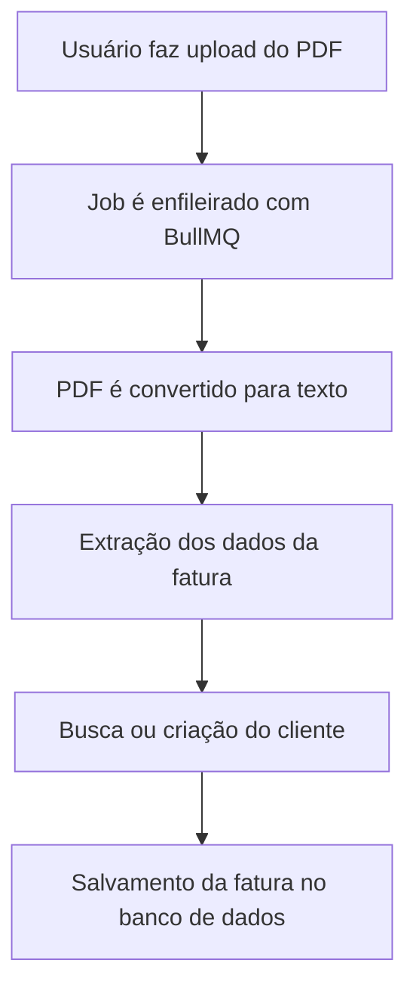

---

## 📤 Fluxo de Upload de Faturas (Invoices)

O sistema utiliza um fluxo **assíncrono** para lidar com o upload e o processamento de faturas de energia elétrica em PDF. Essa arquitetura foi desenhada pensando em **escalabilidade**, **desempenho** e **robustez**.

### 🧭 Etapas do Fluxo

### 🔍 Detalhamento

1. **Upload do Arquivo**
   - O usuário envia um arquivo PDF da fatura.

2. **Disparo do Job (BullMQ)**
   - Um job assíncrono é enfileirado para processar o arquivo sem travar o fluxo principal da API.

3. **Parsing do PDF**
   - O arquivo é convertido para string (texto bruto) para facilitar a extração dos dados.

4. **Extração dos Dados**
   - Utilizamos expressões regulares para capturar campos como:
     - Consumo (kWh)
     - Valores (R$)
     - Número de registro
     - Distribuidora (ex: CEMIG)
     - Mês e ano de referência, entre outros.

5. **Identificação do Cliente**
   - Com base no número de registro e na distribuidora, buscamos o cliente no banco de dados.
   - Caso não exista, um novo registro de cliente é criado.

6. **Persistência da Fatura**
   - A fatura é associada ao cliente e salva no banco.
   - Uma **constraint única** garante que não existam faturas duplicadas para o mesmo cliente no mesmo mês/ano.

---

### ✅ Vantagens da Arquitetura

| Vantagem                          | Descrição                                                                 |
|----------------------------------|---------------------------------------------------------------------------|
| ⚡ Escalabilidade                 | Jobs assíncronos processam múltiplos arquivos em paralelo.               |
| 🔁 Resiliência                   | Falhas no processamento podem ser reprocessadas.                         |
| 🚀 Performance                   | Parsing pesado não bloqueia a resposta HTTP.                             |
| ✅ Consistência                   | Constraints evitam duplicidade de dados.                                 |
| 🧩 Modularidade                   | Casos de uso isolados facilitam testes e manutenção.                     |

---
