---

## 📤 Fluxo de Upload de Faturas (Invoices)

O sistema utiliza um fluxo **assíncrono** para lidar com o upload e o processamento de faturas de energia elétrica em PDF. Essa arquitetura foi desenhada pensando em **escalabilidade**, **desempenho** e **robustez**.

### 🧭 Etapas do Fluxo

```mermaid
graph TD
  A[Usuário faz upload do PDF] --> B[Job é enfileirado com BullMQ]
  B --> C[PDF é convertido para texto]
  C --> D[Extração dos dados da fatura]
  D --> E[Busca ou criação do cliente]
  E --> F[Salvamento da fatura no banco de dados]
```



### 🔍 Detalhamento

1. **Upload do Arquivo**
   - O usuário envia um arquivo PDF da fatura.

2. **Disparo do Job (BullMQ)**
   - Um job assíncrono é enfileirado para processar o arquivo sem travar o fluxo principal da API.

3. **Parsing do PDF**
   - O arquivo é convertido para string (texto bruto) para facilitar a extração dos dados.

4. **Extração dos Dados**
   - Utilizamos expressões regulares para capturar campos como:
     - Consumo (kWh)
     - Valores (R$)
     - Número de registro
     - Distribuidora (ex: CEMIG)
     - Mês e ano de referência, entre outros.

5. **Identificação do Cliente**
   - Com base no número de registro e na distribuidora, buscamos o cliente no banco de dados.
   - Caso não exista, um novo registro de cliente é criado.

6. **Persistência da Fatura**
   - A fatura é associada ao cliente e salva no banco.
   - Uma **constraint única** garante que não existam faturas duplicadas para o mesmo cliente no mesmo mês/ano.

---

### ✅ Vantagens da Arquitetura

| Vantagem            | Descrição                                                                  |
|---------------------|----------------------------------------------------------------------------|
| ⚡ Escalabilidade    | Jobs assíncronos processam múltiplos arquivos em paralelo.                |
| 🔁 Resiliência       | Falhas no processamento podem ser reprocessadas.                          |
| 🚀 Performance       | Parsing pesado não bloqueia a resposta HTTP.                              |
| ✅ Consistência       | Constraints evitam duplicidade de dados.                                  |
| 🧩 Modularidade       | Casos de uso isolados facilitam testes e manutenção.                      |

---

## ▶️ Como Rodar o Projeto Localmente

Este projeto utiliza o **Docker Compose** para facilitar a execução dos serviços de infraestrutura, como banco de dados PostgreSQL, Redis e uma interface visual para o banco (Adminer).

### 💻 Requisitos

- [Node.js 22.x](https://nodejs.org/)
- [Yarn](https://yarnpkg.com/)
- [Docker](https://www.docker.com/) e [Docker Compose](https://docs.docker.com/compose/)

---

### ⚙️ 1. Configurar Variáveis de Ambiente

O projeto utiliza variáveis de ambiente para configurar serviços como banco de dados e integração com a AWS S3.

#### 📄 1.1. Crie um arquivo `.env`

Copie o arquivo de exemplo fornecido (`.env.sample`) e renomeie para `.env`:

```bash
cp .env.sample .env
```

#### ✏️ 1.2. Preencha os valores no `.env`

```env
# Banco de Dados
DB_HOST=database
DB_PORT=5432
DB_NAME=meu_banco
DB_USERNAME=usuario
DB_PASSWORD=senha

# AWS S3
AWS_ACCESS_KEY=minha-chave
AWS_SECRET_KEY=minha-chave-secreta

S3_BUCKET_NAME=nome-do-bucket
S3_REGION=regiao
S3_FOLDER=invoices
FRONTEND_URL= # URL permitida por CORS
```

> **Importante:** O valor de `DB_HOST` deve ser `database`, pois é o nome do serviço no `docker-compose.yml`.

---

### 🐳 2. Subir os Serviços com Docker Compose

Execute o seguinte comando para iniciar os serviços essenciais:

```bash
docker-compose up -d
```

Isso irá subir os seguintes containers:

| Serviço       | Descrição                            | Porta Local |
|---------------|--------------------------------------|-------------|
| **PostgreSQL** | Banco de dados relacional            | 5432        |
| **Redis**      | Armazenamento em memória para jobs  | 6379        |
| **Adminer**    | Interface web para o banco           | 8080        |

Acesse o Adminer pelo navegador:  
[http://localhost:8080](http://localhost:8080)

---

### 🚀 3. Rodar a Aplicação

Com os containers em execução, instale as dependências da aplicação e execute-a localmente:

```bash
yarn install
yarn start:dev
```

A aplicação estará disponível em:  
[http://localhost:3000](http://localhost:3000)

---

### 🧪 4. Rodar os Testes

Este projeto possui testes automatizados organizados em duas categorias:

- **Testes Unitários**
- **Testes End-to-End (E2E)**

#### Rodar Testes Unitários:

```bash
yarn test:unit
```

#### Rodar Testes End-to-End:

```bash
yarn test:e2e
```

---
